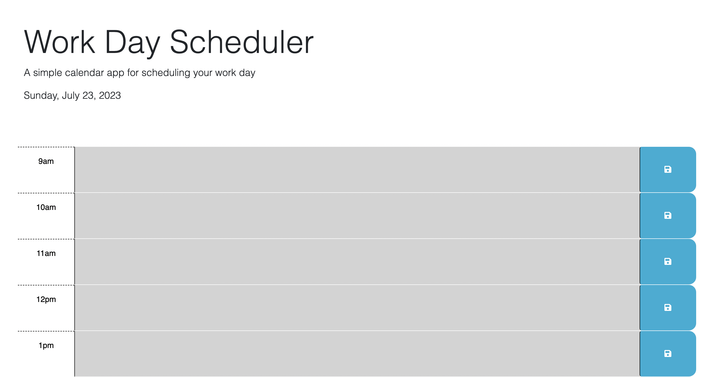

# workflowmaster
Website that helps with a work planner

## Description
The motivation for this web application is to be able to plan out the day using this application. the user can type in the textarea section and save it to their local storage to view later and see which hour was before and the current hour aswell as the next hour.
Github Profile: https://github.com/JR728/workflowmaster

## Usages
The website https://jr728.github.io/workflowmaster/ type what you need to do at a certain hour in the day during work hours and click the save button to save it.

## Images

## Credit
The starter code https://github.com/coding-boot-camp/crispy-octo-meme/tree/main

## License
MIT